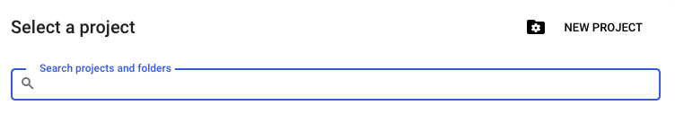
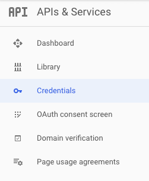
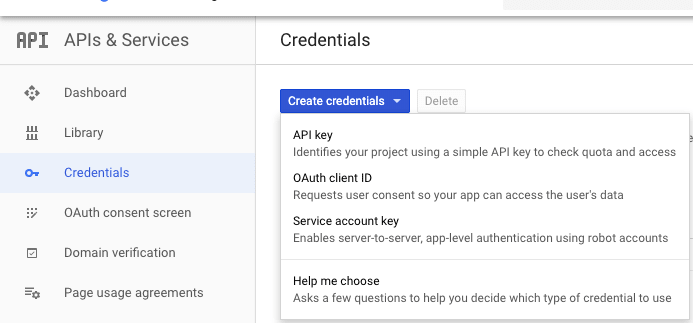
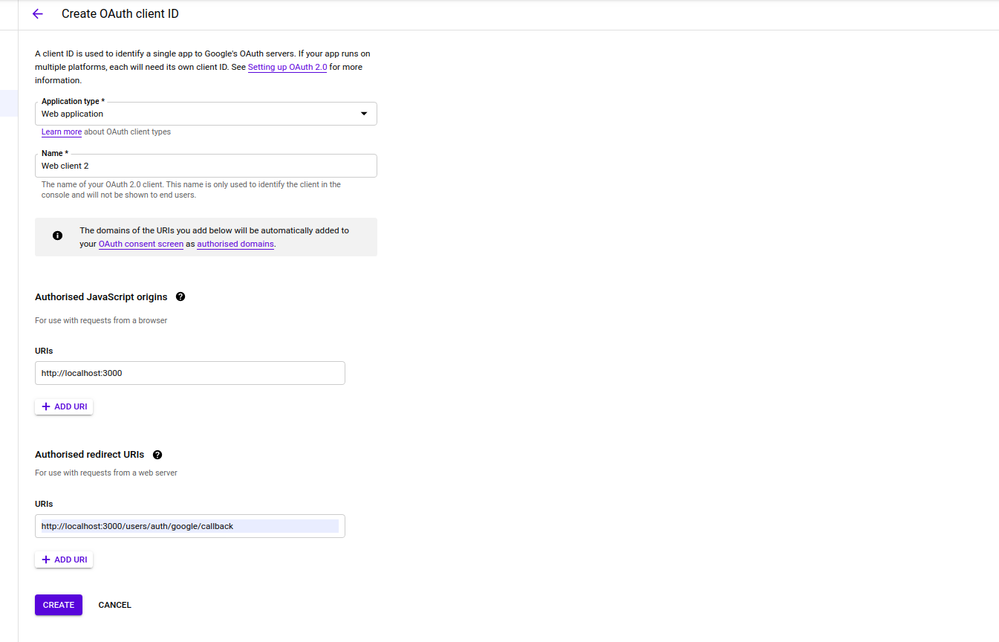
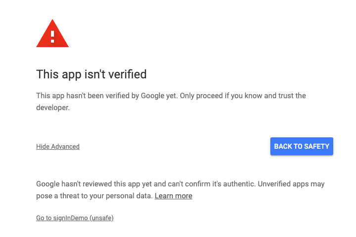

<p align="center"></p>
<h1 align="center">User Authenticator</h1>
<p align="center">Make yourself trusted!</p>

This simple project illustrates the scenarios of Sign In / Sign Up process for a web application with a fully responsive UI. It can be used as a subsystem or template for the projects which need user authentication.
<br>

## Prerequisites

* _NodeJS and related command line tools_: You need to install the latest version  of NodeJS runtime before you do anything. It can be installed in various ways, but we recommend to install it via nvm (Node Version Manager) a bash script used to manage multiple released Node.js versions. To install nvm, apply the instructions on https://github.com/nvm-sh/nvm#install--update-script. Then, type to check
  
    ```
    nvm --version
    ```
    You may list the versions available for installation
    ```
    nvm ls-remote
    ```
    and install one or more of them by 

    ```
    nvm install <version-of-nodejs>
    ```
    Then check if it worked 

    ```
    node --version
    npm  --version
    ```
    Finally, you can pick one of the installed versions by
    ```
    nvm use <version-of-nodejs>
    ```
* _Mongodb_: Install mongodb by the help of [this guide](https://docs.mongodb.com/manual/installation/) or simply 
  download and add its bin directory to your system's $PATH environment variable. Run the following to start mongodb server:
  ```
  mongod --dbpath <directory-path-to-store-actual-data>
  ```
* _Google Credentials_: Get your google __client ID__ and __client secret__ from [google console page](https://console.developers.google.com/) by the following steps, later you will use them while sign in with google
  
  1. From the project drop-down, select an existing project, or create a new one by selecting __Create a new project__
  
      

  2. In the sidebar under "APIs & Services", select __Credentials__
      

  3. In the Credentials tab, select the Create credentials drop-down list, and choose __OAuth client ID__.
     

  4. Under Application type, select __Web application__, give a name whatever you want, and add your domain to __Authorized Javascript Origin__. (For the development environment, localhost is ok). In __Authorized redirect URI__ use http://localhost:3000/users/auth/google/callback
  . Then click __Create__ button. 
     

  5. Copy or download the credentials JSON file by clicking on the download button.
   
      _Note_: When you run this app in the development environment, you will come across the following screen because of not using https, but this will not be the case in the production environment as Heroku itself publishes apps via https. Thus, for now, simply click on show advance and then click on Go to 'your app name'(unsafe) and allow it.

      
   
## Installing
Clone the repository : 

```
git clone https://github.com/aydinmuminkorcan/user.git
``` 
or using ssh 

```
git clone git@github.com:aydinmuminkorcan/user.git
``` 
After cloning the repository, install dependencies by :

```
npm install
```

Finally, for the development environment run:

```
npm run dev
```

Here we go! Open a web browser and go to http://localhost:3000 and authenticate yourself.

## Running the tests
Run the tests by:

```
npm run test
```

### Break down into end to end tests
Explain what these tests test and why

```
Give an example
```

### Coding style tests
Make sure you formatted the code and checked for coding style rules before commit and fix errors if any

```
npm run format
npm run lint
```

## Deployment
Add additional notes about how to deploy this on a live system.

## Built With
* [Express](https://expressjs.com/) - The web framework used
* [npm](https://docs.npmjs.com/) - Dependency Management
* [Mongodb](https://www.mongodb.com/) - Database to store user information
* [Bootstrap](https://getbootstrap.com/) - UI framework 
  

## Contributing
Please read [CONTRIBUTING.md](CONTRIBUTING.md) for details on our code of conduct, and the process for submitting pull requests to us.

## Versioning
We use [SemVer](http://semver.org/) for versioning. For the versions available, see the [tags on this repository](https://github.com/aydinmuminkorcan/user-authenticator/tags). 

## Authors

* **Mumin Korcan Aydin** - *Initial work* - [aydinmuminkorcan](https://github.com/aydinmuminkorcan)

See also the list of [contributors](https://github.com/your/project/contributors) who participated in this project.

## License
This project is licensed under the MIT License - see the [LICENSE](LICENSE) file for details

## Acknowledgements
* Hat tip to anyone whose code was used
* Inspiration
* etc
